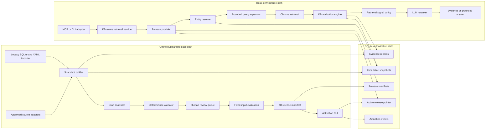
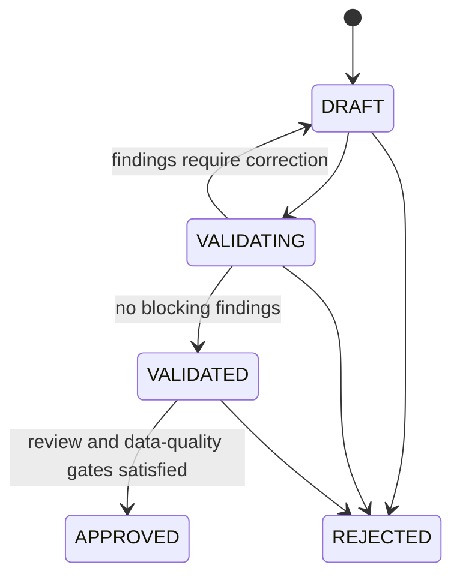
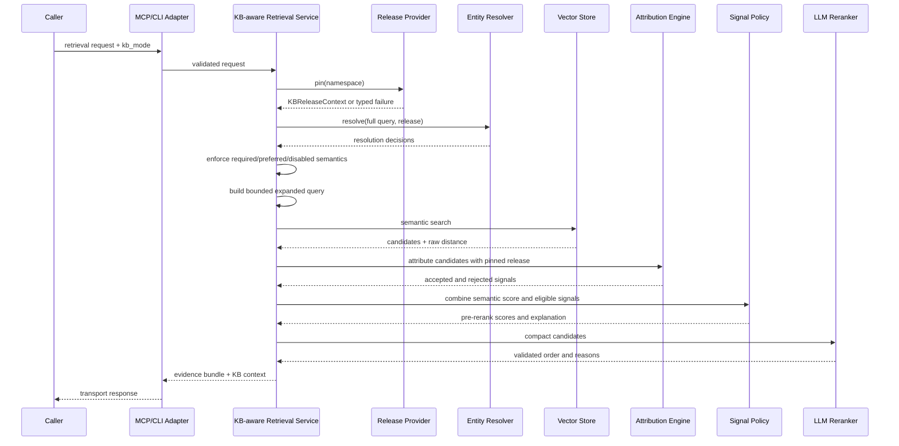

# Entity KB v2 System Design

## Document Control

| Field | Value |
| --- | --- |
| Status | Approved v1.0 |
| Date | 2026-08-15 |
| Product | Financial Agent |
| Scope | Entity KB v1.0 identity foundation and v1.1 relationship seam |
| Approved input | [Entity KB Upgrade PRD](../product/entity-kb-upgrade-prd.md) |
| Governing decision | [ADR-0001](../adr/0001-entity-kb-v2-snapshots-and-signal-boundary.md) |
| API contract | [Entity KB v2 API and Data Contract](../api/entity-kb-v2-api.md) |
| RAG serving design | [RAG Ingestion and Generation Serving System Design](rag-ingestion-serving-system-design.md) |

## 1. Purpose

This design turns the approved Entity KB PRD into an implementable architecture for Financial Agent. It defines:

- authoritative state and ownership boundaries;
- immutable snapshot and runtime-release semantics;
- entity resolution, expansion, attribution, and score handoff;
- SQLite schema and transaction rules;
- runtime and administrative failure behavior;
- migration and rollback;
- observability, security, testing, and staged work packages;
- closure from PRD requirements to API contracts and verification evidence.

This document is design evidence only. It does not prove that the schema, APIs, migrations, tests, or runtime behavior are implemented or deployed.

## 2. Scope Decisions from the Approved PRD

The design uses these approved defaults:

1. Tier A contains the 16 historical evaluation assets: 12 company targets plus DJI, QQQ, SPY, and XLE.
2. Every Tier A company receives reviewed English and Chinese aliases in v1.0.
3. A product mention can strengthen a resolved company and can produce owner candidates, but product mention alone does not automatically select a company target in v1.0.
4. Direct intent uses no relationship hop.
5. v1.1 indirect intent supports one hop across supplier, customer, dependency, competitor, and substitute relationships.
6. Identity facts imported from approved deterministic regulator or exchange fields may become verified after deterministic validation. Facts extracted from unstructured pages require review before activation.
7. Freshness intervals begin with the PRD planning values and are configuration-versioned.
8. KB behavior is explicit through `required`, `preferred`, or `disabled` mode.
9. The approved relative retrieval gates are binding; their pass/fail result cannot be calculated until a refreshed fixed-corpus baseline exists.
10. SQLite is authoritative for v1.0-v1.2. A later major multi-hop relationship-intelligence stage must introduce a graph database under a superseding ADR, while preserving the current domain and release invariants.

Changing these defaults requires a PRD revision or a superseding architecture decision before implementation behavior is frozen.

## 3. Architectural Drivers

### 3.1 Correctness Drivers

- one request must not mix facts from different KB versions;
- ambiguous, stale, rejected, or unsupported facts must not boost ranking;
- every non-zero KB contribution must be explainable from source evidence;
- direct identity and indirect exposure must remain distinct;
- the same KB release and policies must be used by all company-aware entry points;
- aggregate quality gains must not hide unreviewed Tier A regressions.

### 3.2 Operational Drivers

- remain local and SQLite-backed for the current universe;
- serve active data without live source-provider dependency;
- keep activation and rollback short and recoverable;
- preserve existing runtime data and user changes during migration;
- allow legacy readers during a compatibility window;
- avoid exposing administrative mutation through MCP.

### 3.3 Evaluation Drivers

- pin corpus generation, KB snapshot, policy versions, annotations, and model configuration;
- separate data changes from weight changes and reranker effects;
- report resolution, candidate recall, attribution, scoring, and rerank failures separately.

## 4. Business Invariants

| ID | Invariant | Design guarantee | Verification evidence |
| --- | --- | --- | --- |
| INV-01 | At most one active KB release per namespace | nullable `kb_active_state.active_release_id`, namespace primary key, and transactional pointer update | bootstrap, schema, and activation tests |
| INV-02 | Approved facts do not mutate | immutable snapshot rows after approval; changes create a child snapshot | repository and mutation-rejection tests |
| INV-03 | One request uses one KB version | request pins `KBReleaseContext` once and passes it through every stage | concurrent activation test |
| INV-04 | Invalid facts never boost | validator plus runtime eligibility check | table-driven signal tests |
| INV-05 | Ambiguity never silently resolves | resolver returns `ambiguous`; scorer receives no identity-eligible signal | resolver and MCP contract tests |
| INV-06 | KB does not own final relevance | attribution emits typed signals; retrieval policy computes contributions | boundary and serialization tests |
| INV-07 | Every contribution is explainable | signal references alias/relationship and evidence IDs | API invariant tests |
| INV-08 | Data and weights are independently versioned | release binds snapshot and signal-policy versions | release validation tests |
| INV-09 | Failure cannot partially activate | build and evaluation precede a short compare-and-swap transaction | failure-injection tests |
| INV-10 | Fallback is visible | response contains requested mode, applied mode, status, and reason | adapter tests |
| INV-11 | Entry points share the same seam | one application service owns resolution through score handoff | call-path contract tests |
| INV-12 | Rollback preserves audit history | pointer rollback plus append-only activation events | rollback tests |
| INV-13 | Storage does not leak into product semantics | stable domain IDs and repository/application-service boundaries hide SQLite row identity | storage-neutral contract tests |
| INV-14 | Future graph paths preserve trust | every graph node/edge maps to a pinned snapshot and every contributing edge maps to evidence, scope, validity, and freshness | graph projection fixtures and future path Golden Set |

## 5. High-Level Architecture



## 6. Component Responsibilities

### 6.1 Source Adapters

Responsibilities:

- fetch approved structured fields or original source content;
- return source identity, timestamps, content hash, and exact supporting field or quote;
- classify fetch and parse failures;
- never mark a fact active.

Non-responsibilities:

- entity resolution;
- ranking weights;
- snapshot activation;
- silent fallback to model memory.

### 6.2 Legacy Importer

Responsibilities:

- read current `company_entities.db` and seed YAML without modifying either;
- map legacy entities and relationships into proposed v2 records;
- preserve legacy IDs in `kb_legacy_id_map`;
- quarantine records lacking required evidence or failing quality rules;
- produce a deterministic import manifest and report.

Legacy data is migration input, not trusted active v2 data.

### 6.3 Snapshot Builder

Responsibilities:

- create a `DRAFT` snapshot with a parent snapshot and source-manifest hash;
- assign deterministic IDs;
- write entities, aliases, relationships, evidence references, and Tier membership;
- prevent writes after snapshot approval;
- calculate row counts and content checksums.

The builder may perform long work, but it must not hold the active-state transaction open.

### 6.4 Validator

Responsibilities:

- schema and referential-integrity validation;
- required evidence and source-policy validation;
- alias normalization, collision, truncation, and prohibited-token checks;
- entity-type and relationship-direction checks;
- Tier A coverage checks;
- freshness eligibility preview;
- snapshot checksum and count verification;
- stable finding codes and severity.

The validator is deterministic for the same snapshot and policy versions.

### 6.5 Human Review

Responsibilities:

- approve or reject unstructured-source facts;
- resolve high-risk alias collisions;
- correct entity merges or splits;
- adjudicate critical retrieval regressions;
- record reviewer identity, timestamp, decision, and reason.

A review decision creates or updates a draft child snapshot. It never edits an approved snapshot.

### 6.6 Evaluation Service

Responsibilities:

- run resolver and retrieval Golden Sets on fixed inputs;
- compare active and proposed releases;
- isolate KB data, signal policy, and reranker experiment arms;
- tune candidate signal policies on a versioned tuning split and evaluate activation only on an untouched story-group-disjoint holdout;
- emit aggregate, language, relevance-type, and per-asset metrics;
- create an adjudication queue;
- persist one authoritative immutable `kb_evaluation_runs` row with its fixed-input manifest hash, report checksum, and signed-off result status.

### 6.7 Release Builder and Activator

Responsibilities:

- create a Release Candidate that binds one approved snapshot and compatible policy versions and checksums;
- attach an authoritative completed evaluation run to the candidate;
- approve the candidate only when evaluation passed or was explicitly approved with exception;
- create the immutable Final Release only after candidate approval, binding the evaluation manifest and all input checksums;
- activate with compare-and-swap against the expected current release;
- append an activation event;
- rollback by activating a prior verified release.

The activator is a controlled local CLI in v1.0.

### 6.8 Release Provider

Responsibilities:

- read the active release once per request;
- validate release and schema compatibility;
- return immutable `KBReleaseContext`;
- cache immutable release data by release ID;
- never cache the active pointer across requests in a way that hides activation.

### 6.9 Entity Resolver

Responsibilities:

- extract ticker, English, and Chinese mentions from the full query;
- match only policies authorized by the pinned release;
- return resolved, ambiguous, or unresolved decisions;
- preserve offsets, candidate entities, matched aliases, and reason codes;
- avoid automatic fuzzy resolution in v1.0.

The resolver does not retrieve articles or compute a relevance score.

### 6.10 Query Expansion

Responsibilities:

- expand only after target resolution;
- select approved English terms for semantic retrieval;
- enforce direct and indirect term and hop budgets;
- return included and excluded terms with reasons;
- produce deterministic order for the same request and release.

### 6.11 Attribution Engine

Responsibilities:

- examine candidate title, summary, and matched chunk text;
- match candidate evidence to approved aliases and relationships;
- compute freshness and ambiguity state at request time;
- deduplicate repeated aliases for the same fact;
- emit accepted and rejected typed signals.

It does not compute the final candidate score.

### 6.12 Retrieval Signal Policy

Responsibilities:

- map eligible typed signals to numeric contributions;
- apply per-class and total caps;
- preserve raw vector distance and semantic score;
- assign pre-rerank score and position;
- serialize all accepted and rejected contributions;
- identify the policy version.

Weights are configuration data and require an evaluation run before activation.

### 6.13 MCP and CLI Adapters

Responsibilities:

- validate transport parameters;
- select explicit KB mode;
- map service responses without dropping version, degradation, or error fields;
- keep existing v1 tools compatible during migration.

Adapters do not perform entity resolution, scoring, activation, or persistence directly.

## 7. Proposed Module Layout

The exact names may change during implementation, but boundaries shall remain:

```text
src/event_collector/
  kb_contracts.py           # Pydantic/dataclass service contracts
  kb_repository.py          # SQLite read/write repositories
  kb_snapshot.py            # build, validate, release, activate, rollback
  kb_validation.py          # deterministic validation rules
  entity_resolution.py      # mention extraction and resolution
  kb_query_expansion.py     # bounded expansion
  kb_attribution.py         # typed candidate signals
  kb_signal_policy.py       # versioned contribution policy
  kb_service.py             # request-level orchestration and release pinning
  kb_migration.py           # legacy import and verification
  retrieval_orchestration.py# consumes service outputs and owns final ordering
  financial_agent_mcp.py    # transport adapter only

config/
  entity_kb_freshness_policy_v1.json
  entity_kb_resolver_policy_v1.json
  entity_kb_signal_policy_v1.json
```

Existing `entity_kb.py` remains the legacy seam during migration. New behavior shall not be added as an unbounded extension of that file.

Application services, resolvers, attribution, and adapters shall depend on repository protocols and domain contracts rather than SQLite connections, SQL row IDs, or SQL result shapes. This is a current design requirement for the committed graph-database evolution, not permission to implement the graph stage early.

## 8. Storage Design

### 8.1 SQLite Settings and Ownership

- `PRAGMA foreign_keys=ON` is required for every connection.
- Runtime readers use read-only or short-lived thread-owned connections.
- Writer operations use independent connections.
- WAL mode may be enabled only after compatibility verification on the target filesystem.
- External network calls never occur inside a database transaction.
- Activation uses `BEGIN IMMEDIATE` before reading and comparing the active pointer.
- Database transactions remain short; snapshot content is built before activation.

### 8.2 Core Tables

#### `kb_snapshots`

```text
snapshot_id TEXT PRIMARY KEY
namespace TEXT NOT NULL
parent_snapshot_id TEXT NULL
status TEXT NOT NULL
source_manifest_hash TEXT NOT NULL
schema_version TEXT NOT NULL
entity_count INTEGER NOT NULL
alias_count INTEGER NOT NULL
relationship_count INTEGER NOT NULL
content_checksum TEXT NOT NULL
created_at TEXT NOT NULL
validated_at TEXT NULL
approved_at TEXT NULL
approved_by TEXT NULL
rejected_at TEXT NULL
rejection_reason TEXT NULL
```

Constraints:

- status is one of the documented snapshot states;
- approved snapshots reject content mutation at both the repository boundary and database trigger boundary for inserts, updates, and deletes on snapshot-owned content tables;
- lifecycle metadata may advance through documented state transitions, but an approved snapshot's content checksum, counts, and child content rows cannot be edited in place;
- counts and checksum must match snapshot rows before approval.

#### `kb_entities`

```text
snapshot_id TEXT NOT NULL
entity_id TEXT NOT NULL
entity_type TEXT NOT NULL
canonical_name TEXT NOT NULL
canonical_evidence_id TEXT NOT NULL
status TEXT NOT NULL
jurisdiction TEXT NULL
valid_from TEXT NULL
valid_to TEXT NULL
PRIMARY KEY (snapshot_id, entity_id)
```

`entity_id` is stable across snapshots. Entity content is versioned by the composite key.

#### `kb_aliases`

```text
snapshot_id TEXT NOT NULL
alias_id TEXT NOT NULL
entity_id TEXT NOT NULL
alias TEXT NOT NULL
normalized_alias TEXT NOT NULL
alias_type TEXT NOT NULL
language TEXT NOT NULL
match_policy TEXT NOT NULL
strength_class TEXT NOT NULL
ambiguity_class TEXT NOT NULL
evidence_id TEXT NOT NULL
review_status TEXT NOT NULL
valid_from TEXT NULL
valid_to TEXT NULL
PRIMARY KEY (snapshot_id, alias_id)
```

Database uniqueness does not prohibit ambiguous aliases across entities. The validator requires an explicit ambiguity policy and prevents ambiguous aliases from being strong.

#### `kb_relationships`

```text
snapshot_id TEXT NOT NULL
relationship_id TEXT NOT NULL
subject_entity_id TEXT NOT NULL
relation_type TEXT NOT NULL
object_entity_id TEXT NOT NULL
scope_product_id TEXT NULL
scope_region TEXT NULL
evidence_id TEXT NOT NULL
observed_at TEXT NOT NULL
valid_from TEXT NULL
valid_to TEXT NULL
verification_status TEXT NOT NULL
PRIMARY KEY (snapshot_id, relationship_id)
```

Freshness is derived from relationship type, observation time, validity, and the pinned freshness policy.

#### `kb_evidence`

```text
evidence_id TEXT PRIMARY KEY
source_type TEXT NOT NULL
publisher TEXT NOT NULL
source_url TEXT NULL
source_record_id TEXT NULL
published_at TEXT NULL
data_as_of TEXT NULL
retrieved_at TEXT NOT NULL
content_sha256 TEXT NULL
supporting_text TEXT NOT NULL
locator_json TEXT NULL
extraction_method TEXT NOT NULL
created_at TEXT NOT NULL
```

Evidence is append-only and can be shared by multiple snapshots. A content change creates a new evidence ID.

#### `kb_snapshot_assets`

```text
snapshot_id TEXT NOT NULL
entity_id TEXT NOT NULL
tier TEXT NOT NULL
primary_symbol TEXT NOT NULL
PRIMARY KEY (snapshot_id, entity_id)
```

#### `kb_validation_findings`

```text
finding_id TEXT PRIMARY KEY
snapshot_id TEXT NOT NULL
severity TEXT NOT NULL
code TEXT NOT NULL
object_type TEXT NOT NULL
object_id TEXT NULL
message TEXT NOT NULL
details_json TEXT NULL
created_at TEXT NOT NULL
resolved_at TEXT NULL
resolution_review_id TEXT NULL
```

#### `kb_review_decisions`

```text
review_id TEXT PRIMARY KEY
snapshot_id TEXT NOT NULL
object_type TEXT NOT NULL
object_id TEXT NOT NULL
decision TEXT NOT NULL
reason_code TEXT NOT NULL
reason TEXT NULL
reviewer TEXT NOT NULL
created_at TEXT NOT NULL
```

#### `kb_release_candidates`

```text
candidate_id TEXT PRIMARY KEY
namespace TEXT NOT NULL
snapshot_id TEXT NOT NULL
snapshot_checksum TEXT NOT NULL
resolver_policy_version TEXT NOT NULL
resolver_policy_checksum TEXT NOT NULL
freshness_policy_version TEXT NOT NULL
freshness_policy_checksum TEXT NOT NULL
signal_policy_version TEXT NOT NULL
signal_policy_checksum TEXT NOT NULL
schema_version TEXT NOT NULL
id_algorithm_version TEXT NOT NULL
evaluation_run_id TEXT NULL UNIQUE
status TEXT NOT NULL
created_at TEXT NOT NULL
created_by TEXT NOT NULL
evaluated_at TEXT NULL
approved_at TEXT NULL
approved_by TEXT NULL
rejected_at TEXT NULL
rejection_reason TEXT NULL
```

The candidate identity tuple is fixed when created. Only evaluation attachment and lifecycle/audit metadata may advance through the documented transitions.

#### `kb_evaluation_runs`

```text
evaluation_run_id TEXT PRIMARY KEY
candidate_id TEXT NOT NULL
evaluation_manifest_hash TEXT NOT NULL
result TEXT NOT NULL
report_uri TEXT NOT NULL
report_checksum TEXT NOT NULL
started_at TEXT NOT NULL
completed_at TEXT NOT NULL
exception_approved_by TEXT NULL
exception_reason TEXT NULL
```

Completed evaluation rows are immutable. `approved_with_exception` requires both exception fields; `passed` and `failed` require them to be null.

#### `kb_releases`

```text
release_id TEXT PRIMARY KEY
namespace TEXT NOT NULL
snapshot_id TEXT NOT NULL
snapshot_checksum TEXT NOT NULL
resolver_policy_version TEXT NOT NULL
resolver_policy_checksum TEXT NOT NULL
freshness_policy_version TEXT NOT NULL
freshness_policy_checksum TEXT NOT NULL
signal_policy_version TEXT NOT NULL
signal_policy_checksum TEXT NOT NULL
evaluation_run_id TEXT NOT NULL
evaluation_manifest_hash TEXT NOT NULL
schema_version TEXT NOT NULL
id_algorithm_version TEXT NOT NULL
created_at TEXT NOT NULL
created_by TEXT NOT NULL
```

Final Release rows are insert-only. They have no mutable lifecycle status: current/superseded is derived from `kb_active_state` and `kb_activation_events`.

#### `kb_active_state`

```text
namespace TEXT PRIMARY KEY
active_release_id TEXT NULL
lock_version INTEGER NOT NULL
updated_at TEXT NULL
updated_by TEXT NULL
```

Every configured namespace is seeded with `active_release_id=NULL` and `lock_version=0`. This represents a valid bootstrap state before the first activation.

#### `kb_activation_events`

```text
event_id TEXT PRIMARY KEY
namespace TEXT NOT NULL
from_release_id TEXT NULL
to_release_id TEXT NOT NULL
operation TEXT NOT NULL
expected_lock_version INTEGER NOT NULL
resulting_lock_version INTEGER NOT NULL
actor TEXT NOT NULL
reason TEXT NOT NULL
created_at TEXT NOT NULL
```

#### `kb_legacy_id_map`

```text
legacy_source TEXT NOT NULL
legacy_id TEXT NOT NULL
entity_id TEXT NOT NULL
snapshot_id TEXT NOT NULL
PRIMARY KEY (legacy_source, legacy_id, snapshot_id)
```

### 8.3 Optional Audit Tables

`kb_resolution_decisions` and `retrieval_kb_signals` are persisted for evaluation and explicitly enabled debug runs. Online serving does not persist raw user queries by default.

If an online resolution decision is persisted, it stores a keyed query hash and the minimum necessary mention data under an explicit retention policy.

### 8.4 Deterministic IDs

- `snapshot_id`: content-addressed prefix plus creation nonce or approved deterministic build ID;
- `entity_id`: stable curated namespace ID, preserved across snapshots;
- `alias_id`: deterministic hash of entity, alias type, language, normalized alias, and validity scope;
- `relationship_id`: deterministic hash of subject, relationship type, object, and scope;
- `evidence_id`: hash of canonical source identity, source version or content hash, and locator;
- `candidate_id`: unique workflow ID; the bound input tuple becomes immutable when evaluation starts;
- `evaluation_run_id`: unique immutable evaluation identity; its manifest hash covers corpus/index generation, Golden Sets, split, model/runtime configuration, and candidate inputs;
- `release_id`: hash of snapshot ID/checksum, all policy versions/checksums, evaluation run ID/manifest hash, schema version, and `id_algorithm_version`;
- activation and review IDs: unique event IDs.

Hash inputs and canonical serialization must be versioned to avoid silent ID drift.

All IDs in this section are domain identities, not SQLite row addresses. A future graph projection shall reuse them as node, edge, evidence, snapshot, and release identities so storage migration does not change API semantics.

## 9. State Models

### 9.1 Snapshot Lifecycle



Snapshot content is mutable only in `DRAFT`. Lifecycle metadata may advance, but approved content rows do not change.

### 9.2 Release Candidate and Final Release Lifecycle

```text
Release Candidate:
DRAFT -> EVALUATED -> APPROVED
  |          |
  +----------+-> REJECTED

Final Release:
created once from APPROVED candidate -> immutable

ACTIVE / SUPERSEDED:
derived only from Active Pointer + Activation Events
```

A Release Candidate is created from an approved snapshot and policy tuple before evaluation. It cannot be approved unless its snapshot remains approved, policy schemas and checksums are compatible, and its authoritative evaluation run is `passed` or `approved_with_exception`. Candidate approval creates one immutable Final Release; activation never edits either record.

### 9.3 Resolution States

```text
resolved   = one target satisfies policy
ambiguous  = multiple plausible targets or contextual alias requires more evidence
unresolved = no target satisfies policy
```

Only `resolved` may authorize target-specific KB boosting.

### 9.4 KB Application States

```text
applied        = KB release pinned and target resolved
semantic_only = explicitly disabled or preferred-mode degradation
not_applicable = no entity-targeted behavior requested
error          = required mode cannot satisfy contract
```

## 10. Offline Build and Activation Flow

### 10.1 Build

1. Read the active release and choose its snapshot as parent.
2. Inventory approved inputs and calculate a source-manifest hash.
3. Insert a `DRAFT` snapshot record.
4. Import legacy and new source proposals.
5. Run deterministic normalization and ID generation.
6. Write snapshot rows and evidence references.
7. Record counts and content checksum.

### 10.2 Validate and Review

1. Transition `DRAFT -> VALIDATING`.
2. Run all validators and persist findings.
3. Return to `DRAFT` for blocking corrections or transition to `VALIDATED`.
4. Review high-risk facts and alias collisions.
5. Rebuild a child draft if review changes content.
6. Approve the immutable snapshot only after checksums and Tier gates pass.

### 10.3 Evaluate

1. Create a `DRAFT` Release Candidate from the approved snapshot and proposed policy versions/checksums. Its `evaluation_run_id` is initially null.
2. Pin corpus/index generation and annotation version.
3. Pin a story-group-disjoint tuning/activation-holdout split and verify that duplicate or revised stories do not cross it.
4. Select candidate weights on the tuning split without reading activation-holdout outcomes.
5. Run semantic-only, active release, proposed-data/current-policy, and proposed-release arms on the untouched activation holdout.
6. Produce per-asset, aggregate, language, and direct/indirect metrics.
7. Adjudicate lost relevant hits and critical false positives; any holdout-driven policy change requires a new policy version and new untouched holdout.
8. Persist the completed immutable evaluation run, including manifest and report hashes, and attach it to the candidate.
9. Transition the candidate to `EVALUATED` for a completed run. A `failed` result may only lead to `REJECTED`; `passed` or `approved_with_exception` may be approved.
10. In one short transaction, `release-approve` verifies the candidate and evaluation again, transitions the candidate to `APPROVED`, and inserts one immutable Final Release whose ID binds every approved input. Failure rolls back both changes; an identical retry returns the existing Final Release without mutation.

### 10.4 Activate

Preconditions are checked outside the transaction. The transaction performs only the authoritative state change:

```text
BEGIN IMMEDIATE
read kb_active_state for namespace
verify active_release_id and lock_version equal operator expectation
verify target Final Release exists and its immutable tuple is runtime-compatible
update active_release_id and increment lock_version
insert activation event
COMMIT
```

If any comparison fails, roll back without changing the pointer.

### 10.5 Rollback

Rollback is a new activation event targeting a prior immutable compatible Final Release. It does not delete, rewrite, or downgrade either release's historical records.

## 11. Runtime Retrieval Flow



### 11.1 Release Pinning

The active pointer is read once. The service validates:

- release ID and namespace;
- snapshot status;
- schema compatibility;
- policy files and checksums;
- required Tier availability when applicable.

The immutable release context is passed explicitly. Downstream code must not re-read the active pointer.

### 11.2 KB Mode

| Requested mode | Valid release | Resolved target | Behavior |
| --- | --- | --- | --- |
| required | yes | yes | apply KB |
| required | no | any | typed error; no retrieval answer |
| required | yes | ambiguous/unresolved | typed resolution error; no target boost |
| preferred | yes | yes | apply KB |
| preferred | no | any | semantic-only, status `degraded` |
| preferred | yes | ambiguous/unresolved | semantic-only, status `degraded` |
| disabled | ignored | ignored | semantic-only, status `success` |

### 11.3 Mention Extraction and Resolution

Resolution order:

1. exchange-qualified or explicit ticker;
2. exact reviewed strong alias;
3. exact canonical name;
4. target context plus uniquely owned reviewed product;
5. weak or ambiguous candidates.

Multiple mentions are returned. v1.0 selects at most one requested target. If more than one asset is equally requested, the decision is ambiguous unless the caller supplies `target_entity_id`.

### 11.4 Expansion

Direct expansion priority:

1. primary ticker;
2. canonical English name;
3. reviewed common English alias;
4. explicitly mentioned reviewed products;
5. remaining products up to the term budget.

Chinese questions are resolved through Chinese aliases, then expanded with approved English terms for the current English embedding model.

Indirect expansion adds at most one verified relationship hop and records the relationship IDs behind every term.

### 11.5 Semantic Retrieval

The vector layer remains responsible for:

- embedding the effective query;
- retrieving chunk candidates;
- applying corpus eligibility;
- aggregating chunks into canonical story groups;
- returning raw distance, matched chunks, and article metadata.

The KB design does not claim that the existing relative normalized vector score is calibrated. The API preserves both raw distance and the semantic score actually used by the active retrieval policy.

### 11.6 Candidate Attribution

The attribution text consists of normalized title, summary, and matched chunk text. Each match produces a typed signal candidate.

Deduplication rules:

- the same alias fact counts once per article and target;
- multiple aliases proving the same identity signal do not stack without a distinct policy rule;
- duplicate publisher stories grouped into one canonical story share one scoring decision;
- direct and indirect signals remain separately enumerable.

### 11.7 Freshness

Freshness is calculated at request time:

```text
current: within configured review interval and valid on request as_of
aging: within configured warning window
stale: expired, outside validity, or missing required observation evidence
```

Under the locked initial `freshness.v1` semantics, only `current` is boost-eligible. Both `aging` and `stale` contribute zero. `aging` remains visible for review and observability. Any reduced aging contribution requires new freshness and signal policy versions plus fixed-input evaluation.

### 11.8 Score Handoff

The score layer receives:

- raw vector distance;
- semantic score used by the current retrieval policy;
- typed accepted and rejected KB signals;
- pinned signal-policy version.

It returns:

- semantic weight and weighted semantic score;
- every signal contribution;
- total KB contribution and cap application;
- combined pre-rerank score;
- pre-rerank position;
- reasons for zero contribution.

The LLM reranker may change ordering but cannot change the stored score explanation, add candidates, or remove candidates from its input. Post-rerank position and reason are recorded separately.

### 11.9 Locked Initial Price-In-Aware Policy

The initial policy deliberately gives verified indirect relationships more ranking influence than direct matches. Direct information is treated as more likely to be captured by semantic retrieval and already reflected in price; direct KB contributions remain meaningful secondary ranking features while every non-zero indirect relationship contribution is strictly larger than the direct total cap. This is an approved product hypothesis evaluated through the retrieval Golden Set.

```text
policy version              signals.price_in.v1
semantic weight             0.70

direct identity class:
  direct_ticker              0.10
  direct_company_alias       0.10
  identity class cap         0.10

other direct classes:
  direct_product_owner       0.05
  direct_executive_context   0.02
  direct total cap           0.15

one-hop indirect:
  indirect_dependency        0.30
  indirect_supplier          0.27
  indirect_customer          0.23
  indirect_substitute        0.20
  indirect_competitor        0.18
  indirect total cap         0.30
```

The combination formula is:

```text
weighted_semantic_score = 0.70 * semantic_score
combined_pre_rerank_score = weighted_semantic_score + kb_total_after_cap
```

For direct intent, distinct classes may add up to the direct cap, but ticker and company-alias evidence proving the same identity share one class cap. For indirect intent, sort otherwise-eligible signals by contribution descending and then `relationship_id` ascending. Only the first remains boost-eligible; all remaining signals receive zero contribution and `LOWER_PRIORITY_RELATIONSHIP`. Direct and indirect contributions are not accumulated together for one candidate decision. Alias count, duplicate labels, and multiple paths do not add extra weight. Theme and business-line context contributes zero without a verified directed relationship.

No additional semantic-score hard gate is introduced by this policy. Existing vector retrieval determines the candidate pool; signal eligibility still rejects ambiguous, stale, rejected, unverified, or provenance-invalid facts with zero contribution.

## 12. Failure and Recovery Semantics

| Failure | Required mode | Preferred mode | Recovery owner |
| --- | --- | --- | --- |
| no active release | error | semantic-only degraded | KB operator |
| incompatible schema or policy | error | semantic-only degraded | deployment/operator |
| ambiguous target | resolution error | semantic-only degraded | caller/user |
| unresolved target | resolution error | semantic-only degraded | caller/user or KB curator |
| stale or rejected fact | zero signal contribution | zero signal contribution | curator/refresh |
| corrupt evidence reference | release invalid; error | semantic-only degraded | operator |
| vector-store failure | retrieval error | retrieval error | corpus/runtime owner |
| reranker failure | query error under existing policy | same | model/runtime owner |
| snapshot build failure | active release unchanged | active release unchanged | builder/operator |
| evaluation failure | activation blocked | activation blocked | product/evaluation owner |
| activation conflict | no pointer change | no pointer change | operator retries after refresh |

No external side effect is blindly retried under an unknown outcome. Activation is locally transactional and can be reconciled by reading the active state and activation event.

## 13. Concurrency and Consistency

### 13.1 Runtime Reads

- each request pins one release;
- immutable snapshot data can be cached by release ID;
- active pointer is read at the request boundary;
- a concurrent switch affects later requests only;
- no snapshot rows referenced by a Final Release are deleted.

### 13.2 Snapshot Build

- one logical builder owns a draft snapshot;
- build attempts are idempotent by source-manifest hash and build ID;
- repeated writes with conflicting content are rejected;
- long source fetches happen before or outside short database transactions.

### 13.3 Activation

- use an independent SQLite connection;
- acquire `BEGIN IMMEDIATE` before reading active state;
- compare expected release and `lock_version`;
- write pointer and event in the same transaction;
- commit before reporting success;
- on timeout, reconcile active state instead of assuming success or failure.

## 14. Configuration and Versioning

### 14.1 Policy Files

Resolver, freshness, and signal policies are versioned JSON files validated at startup. Each file includes:

```text
policy_type
policy_version
schema_version
effective_from
settings
content_sha256
```

The release stores the versions and checksums used during evaluation.

Signal-policy files must also declare the combination algorithm, signal bases, freshness handling, per-class caps, total cap, duplicate/corroboration behavior, and supported direct/indirect intents. API examples must identify whether their numbers are illustrative or correspond to the approved initial policy.

### 14.2 Compatibility Rules

- runtime code declares supported KB schema and policy schema ranges;
- activation refuses an unsupported tuple;
- activation validates an explicit compatibility matrix over runtime version, KB schema, resolver policy, freshness policy, signal policy, and any required storage projection schema;
- startup does not silently coerce unknown enums or fields;
- additive optional response fields use minor API versions;
- changed semantics or removed fields require a new major API version.

## 15. Security and Privacy

- only controlled local operator commands can build, approve, activate, or roll back releases;
- MCP exposes read-only resolver/profile/retrieval behavior in v1.0;
- source URLs and supporting text are treated as data, not executable instructions;
- query text is not persisted by default;
- debug persistence requires explicit enablement and retention configuration;
- operator identity and reason are mandatory for approval, activation, and rollback;
- file paths and database paths are configuration-validated and not accepted from ordinary MCP callers.

## 16. Observability

### 16.1 Structured Request Fields

Each company-aware request should emit:

- request/correlation ID;
- applied API version;
- requested and applied KB mode;
- release, snapshot, and policy versions;
- corpus/index generation ID;
- resolution status and reason codes;
- expansion term counts;
- accepted/rejected/stale/ambiguous signal counts;
- semantic-only degradation reason;
- retrieval and rerank latency;
- terminal status and error code.

Raw query and evidence text are excluded from default logs.

### 16.2 Operational Metrics

- active release age;
- Tier A freshness violations;
- resolver resolved/ambiguous/unresolved rates by language;
- semantic-only degradation rate;
- signal acceptance and rejection rates by class;
- stale-signal suppression count;
- activation attempts, conflicts, and rollbacks;
- per-asset Golden Set changes.

## 17. Performance Targets

These are planning targets, not measured facts:

- warm local entity resolution p95 <= 25 ms for the Tier A/B universe;
- total KB-specific overhead before vector search p95 <= 50 ms;
- active-pointer read and release validation p95 <= 10 ms after immutable release data is cached;
- activation transaction <= 1 second under normal local conditions;
- serving an active release requires zero network calls;
- resolver and attribution memory remain bounded by active release size.

Performance claims require benchmark evidence on the target host and database.

## 18. Migration Strategy

### Stage 1: Side-by-Side Schema

- add v2 tables without changing legacy readers;
- provide schema verification and forward-compatible migration metadata;
- keep legacy database and YAML untouched.

### Stage 2: Read-Only Legacy Import

- generate a draft snapshot and import report;
- quarantine missing-evidence and invalid aliases;
- preserve ID mappings;
- perform no active-state change.

### Stage 3: Tier A Curation and Golden Sets

- curate English/Chinese aliases and asset types;
- add evidence and freshness data;
- build resolver fixtures and hard negatives;
- approve no snapshot yet.

### Stage 4: Shadow Evaluation

- run v1 and v2 in offline comparison on the same corpus;
- verify resolver, attribution, score explanation, and per-asset retrieval;
- resolve critical findings.

### Stage 5: Read-Only v2 Exposure

- expose resolver and retrieval v2 behind an explicit feature flag or API version;
- keep existing tools available;
- report applied mode and release context.

### Stage 6: Active Release

- approve the evaluated release;
- activate with expected-current compare-and-swap;
- run read-only smoke tests;
- preserve rollback release ID.

### Stage 7: Entry-Point Closure

- move every company-aware entry point to the shared v2 service;
- remove silent KB bypass;
- retain semantic-only behavior only through explicit mode.

### Stage 8: Graph-Migration Readiness

This stage prepares, but does not deploy, the graph database committed by the PRD:

- prove that stable entity, relationship, evidence, snapshot, and release IDs export without SQLite row identity;
- produce deterministic node and directed-edge projection fixtures with scope, validity, freshness inputs, and evidence references;
- verify projection counts and checksums against an approved snapshot;
- keep SQLite as the only editable authority and perform no runtime graph reads;
- use the results as input to the superseding graph-storage ADR.

The later major graph implementation is a separate release program. Its design must choose either a single graph authority or an immutable rebuildable graph projection. It must not introduce dual editable authority.

## 19. Rollback Strategy

Rollback triggers include:

- integrity or schema mismatch;
- unexplained Tier A regression after activation;
- high semantic-only degradation caused by release loading;
- incorrect alias collision or relationship promotion;
- incompatible adapter response.

Rollback steps:

1. resolve and verify the prior immutable compatible Final Release ID;
2. activate it using compare-and-swap against the current release;
3. append a rollback activation event with reason;
4. run resolver and retrieval smoke checks;
5. leave failed release data intact for investigation;
6. create a new child snapshot for corrections.

## 20. TDD Work Packages

Every runtime work package follows `SELECT INVARIANT -> WRITE TEST -> VERIFY RED -> IMPLEMENT -> VERIFY GREEN -> REGRESSION -> SCOPE CHECK -> RECORD EVIDENCE`.

### WP-01 Contracts and Policy Loaders

Invariants:

- enums and required fields reject unknown semantics;
- policy checksums and versions are validated;
- no runtime behavior is changed yet.

### WP-02 SQLite Schema and Repository

Invariants:

- foreign keys hold;
- approved snapshots reject content mutation;
- one active state exists per namespace;
- namespace bootstrap starts with a null active release and lock version zero;
- completed evaluation runs and Final Releases reject mutation;
- release tuple validation is deterministic.
- repository results expose domain contracts rather than SQLite row IDs or connection objects.

### WP-03 Legacy Import and Validation

Invariants:

- import is read-only against legacy inputs;
- bad generic and truncated aliases are quarantined;
- rerunning the same manifest is idempotent;
- findings have stable codes.

### WP-04 Entity Resolver

Invariants:

- full natural-language ticker and alias resolution works;
- Chinese aliases expand to approved English terms;
- ambiguous aliases never auto-resolve;
- product-only mentions do not select a company.

### WP-05 Attribution and Signals

Invariants:

- direct, indirect, and contextual classes are separate;
- stale/rejected/ambiguous signals contribute zero eligibility;
- aging signals contribute zero under `freshness.v1`;
- duplicate aliases do not stack the same fact;
- every accepted signal has evidence;
- direct contributions remain capped at `0.15`; the smallest non-zero indirect relationship contribution, `0.18`, is greater than that direct total cap;
- one indirect article-target pair uses the deterministic contribution-descending, relationship-ID-ascending winner; lower-priority relationships receive the stable rejection code.

### WP-06 Retrieval Integration

Invariants:

- one request pins one release;
- semantic score and raw distance are preserved;
- score contribution and pre/post-rerank order are exposed;
- entry points use the same service seam;
- the initial policy applies no additional semantic-score hard gate to candidates already returned by vector retrieval.

### WP-07 MCP/API Compatibility

Invariants:

- required/preferred/disabled semantics match the API document;
- v1 behavior remains available during migration;
- adapters cannot drop degradation or version fields;
- no administrative mutation is exposed.

### WP-08 Evaluation, Activation, and Rollback

Invariants:

- candidate approval requires immutable evaluation evidence and creates one immutable Final Release;
- activation requires an existing compatible Final Release;
- compare-and-swap prevents lost updates;
- concurrent requests remain pinned;
- rollback changes only the pointer and appends an event.

### Future WP-GRAPH: Graph Relationship Intelligence

This work package is mandatory for the later major graph stage but is not part of v1.0-v1.2 implementation. It begins only after a superseding ADR defines graph technology, fact authority, projection/cutover, deployment, backup/restore, and failure semantics. Expected-RED tests must cover path provenance, version pinning, projection completeness, mixed-version rejection, and rollback before graph runtime code is written.

## 21. System Design and API Closure Review

| PRD area | System owner | API/Data contract | Primary verification |
| --- | --- | --- | --- |
| FR-01 asset types | snapshot builder/repository | `EntitySummary`, entity tables | schema fixtures |
| FR-02 evidence | source adapters/repository | `EvidenceRef`, `kb_evidence` | provenance validation |
| FR-03, FR-04 aliases | validator/resolver | `AliasMatch`, alias tables | collision and quality cases |
| FR-05 freshness | freshness policy/attribution | `FreshnessState`, signal fields | as-of table tests |
| FR-06 snapshots and releases | builder/evaluator/activator | candidate, evaluation, Final Release, and admin CLI contracts | lifecycle, immutability, and transaction tests |
| FR-07 resolution | resolver | `resolve_entities` | English/Chinese/ambiguity Golden Set |
| FR-08 attribution | attribution engine | `KBSignal` | direct hard negatives |
| FR-09 relationships | repository/attribution | relationship fields | direction and scope tests |
| FR-10 expansion | query expansion | `QueryExpansion` | deterministic budget tests |
| FR-11, FR-12 signals and score | attribution/retrieval | `KBSignal`, `ScoreBreakdown` | boundary and cap tests |
| FR-13 explanation | application service | retrieval v2 response | serialization invariants |
| FR-14 review | review workflow | offline admin command | append-only audit tests |
| FR-15 evaluation | evaluation service | evaluation manifest/report | fixed-input comparison |
| FR-16 entry points | KB-aware service/adapters | MCP v2 contracts | call-path tests |
| FR-17 failures | service boundary | error catalog and KB modes | failure matrix tests |

Closure conditions before implementation starts:

1. ADR-0001 is accepted.
2. This System Design and the API/Data Contract agree on all state and error semantics.
3. The Tier A universe and recommended defaults remain approved.
4. The approved relative retrieval gates, no-hidden-regression gate, and explainability gate are binding; acceptance results require the refreshed baseline.
5. No unowned field, transition, recovery action, or verification method remains in the v1.0 contract.
6. Storage-neutral IDs and repository boundaries are sufficient to feed the future graph-storage ADR without changing public v2 semantics.

Closure Review result on 2026-08-15: **GO for implementation planning**. ADR-0001 is accepted, this design and the API contract use the same lifecycle and scoring semantics, and no P1 design blocker remains. This approval does not claim implementation or runtime acceptance.

## 22. Known Proof Limits

- This design does not prove current KB quality, production data, deployment, performance, or provider availability.
- Historical retrieval reports are problem evidence, not current acceptance evidence.
- SQLite is selected for the current bounded scope; no production-scale throughput claim is made.
- Chinese alias resolution does not prove multilingual semantic embedding quality.
- A passing resolver or retrieval test does not prove grounded answer quality.
- A successful release activation does not prove that downstream users saw better results.
